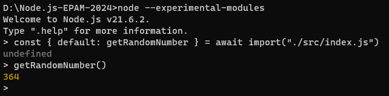
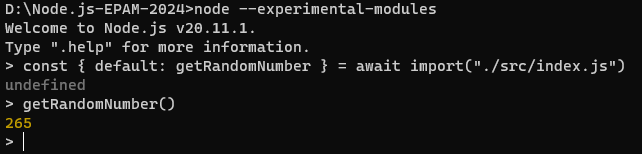

# Node.js EPAM Mentoring program 2024

# Task 1. Introduction to Node.js
- **src/task1/index.ts**: getRandomNumber() function is exported by default. The function returns a random integer from 1 to 1000;
- nodemon is installed as dev dependency;
- src/task1/index.ts file is started via npm script command using nodemon;
- NVM is installed. Two versions of Node.js are installed - LTS one and the latest released one.
  
  

### Usage
To use the `getRandomNumber()` function run in terminal:

```javascript
node--
experimental - modules
const {default: getRandomNumber} = await import("./index.ts");
getRandomNumber()
```

# Task 2. Standard Library
**src/task2/activityMonitor.ts**: 
- shows the most CPU-intensive process that's running on the system;
- program uses system shell command output to retrieve process name, CPU, and memory usage details;
- refresh rate is ten times per second;
- the program uses only the standard library;
- each update will NOT start from the new line. It is always displayed only in one row;
- once per minute program appends the output to the log file src/task2/activityMonitor.log in the format `<unixtime> : <process info>.` If the file doesn't exist - the program creates it.
- program supports Linux, macOS, and Windows operating systems.

# Task 3. EventEmitter & Buffer & Streams

1) **src/task3/EventEmitter.ts**: custom EventEmitter class. It contains methods:
   - on/addEventListener, 
   - off/removeEventListener, 
   - once,
   - emit,
   - rawListeners,
   - listenerCount. 
2) **src/task3/WithTime.ts**: extends EventEmitter. It contains execute() method that calls async function with arguments specified and computes the time it takes to execute this async function.
3) **src/task3/CsvToJsonConverter.ts**:
   1) Reads the content of CSV file
   ```json
   Book,Author,Amount,Price
   The Compound Effect,Darren Hardy,5,9.48
   The 7 Habits of Highly Effective People,Stephen R. Covey,4,23.48
   The Miracle Morning,Hal Elrod,10,21.34
   Influence: The Psychology of Persuasion,Robert B. Cialdini,4,12.99
   The ONE Thing,Gary Keller,1,11.18
   ```
   2) Uses the csvtojson package to convert the data from CSV file to JSON format 
   3) Writes the content of CSV file to a new TXT file in the following format
   ```json
   {"book":"The Compound Effect","author":"Darren Hardy","price":9.48}
   {"book":"The 7 Habits of Highly Effective People","author":"Stephen R. Covey","price":23.48}
   {"book":"The Miracle Morning","author":"Hal Elrod","price":21.34}
   {"book":"Influence: The Psychology of Persuasion","author":"Robert B. Cialdini","price":12.99}
   {"book":"The ONE Thing","author":"Gary Keller","price":11.18}
   ```

### Usage
```javascript
npm run start:task3
```
