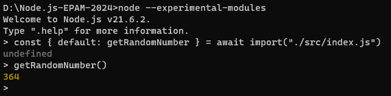

# Node.js EPAM Mentoring program 2024

# Task 1. Introduction to Node.js
- index.js: getRandomNumber() function is exported by default. The function returns a random integer from 1 to 1000.
- nodemon is installed as dev dependency.
- index.js file is started via npm script command using nodemon
- NVM is installed. Two versions of Node.js are installed - LTS one and the latest released one.
  
  

### Usage
To use the `getRandomNumber()` function run in terminal:
```javascript
node --experimental-modules
const { default: getRandomNumber } = await import("./src/index.js");
getRandomNumber()
