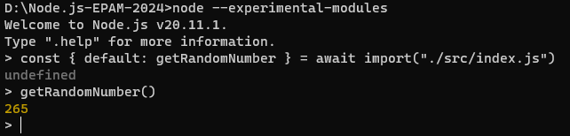
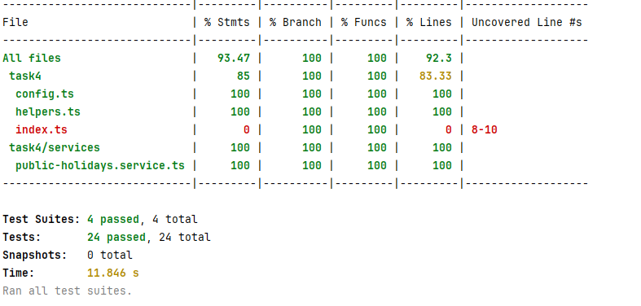

# Node.js EPAM Mentoring program 2024

# Task 1. Introduction to Node.js
- **src/task1/server.ts**: getRandomNumber() function is exported by default. The function returns a random integer from 1 to 1000;
- nodemon is installed as dev dependency;
- src/task1/server.ts file is started via npm script command using nodemon;
- NVM is installed. Two versions of Node.js are installed - LTS one and the latest released one.
  
  

### Usage
To use the `getRandomNumber()` function run in terminal:

```cmd
tsc src/task1/server.ts
node
const { default: getRandomNumber } = await import("./dist/src/task1/index.js");
getRandomNumber.default()
```

# Task 2. Standard Library
**src/task2/activityMonitor.ts**:
- shows the most CPU-intensive process that's running on the system;
- program uses system shell command output to retrieve process name, CPU, and memory usage details;
- refresh rate is ten times per second;
- the program uses only the standard library;
- each update will NOT start from the new line. It is always displayed only in one row;
- once per minute program appends the output to the log file src/task2/activityMonitor.log in the format `<unixtime> : <process info>.` If the file doesn't exist - the program creates it.
- program supports Linux, macOS, and Windows operating systems.

# Task 3. EventEmitter & Buffer & Streams

1) **src/task3/EventEmitter.ts**: custom EventEmitter class. It contains methods:
   - on/addEventListener,
   - off/removeEventListener,
   - once,
   - emit,
   - rawListeners,
   - listenerCount.
2) **src/task3/WithTime.ts**: extends EventEmitter. It contains execute() method that calls async function with arguments specified and computes the time it takes to execute this async function.
3) **src/task3/CsvToJsonConverter.ts**:
   1) Reads the content of CSV file
   ```json
   Book,Author,Amount,Price
   The Compound Effect,Darren Hardy,5,9.48
   The 7 Habits of Highly Effective People,Stephen R. Covey,4,23.48
   The Miracle Morning,Hal Elrod,10,21.34
   Influence: The Psychology of Persuasion,Robert B. Cialdini,4,12.99
   The ONE Thing,Gary Keller,1,11.18
   ```
   2) Uses the csvtojson package to convert the data from CSV file to JSON format
   3) Writes the content of CSV file to a new TXT file in the following format
   ```json
   {"book":"The Compound Effect","author":"Darren Hardy","price":9.48}
   {"book":"The 7 Habits of Highly Effective People","author":"Stephen R. Covey","price":23.48}
   {"book":"The Miracle Morning","author":"Hal Elrod","price":21.34}
   {"book":"Influence: The Psychology of Persuasion","author":"Robert B. Cialdini","price":12.99}
   {"book":"The ONE Thing","author":"Gary Keller","price":11.18}
   ```

### Usage
```cmd
npm run start:task3
```

# Task 4. Testing in Node.js

Unit tests:
- src/task4/helpers.test.ts
- src/task4/services/public-holidays.service.test.ts

Integration tests:
- src/task4/services/public-holidays.service.integration.test.ts

E2E tests for https://date.nager.at/swagger/index.html:
- src/task4/services/nager-date-api.e2e.test.ts



# Task 5. Network

### Notes:
- [swagger.yaml](resources/task5/swagger.yaml)
- [app.postman_collection.json](resources/task5/app.postman_collection.json)

### How to install pm2: (works on MACOS only)
```cmd
npm i pm2 -g  
pm2 install typescript  
npm i bun -g
```

### Changes:
- Server is created using http module **src/task5/server.ts**
- Commands to start and stop server are added to package.json: npm run start:task5, npm run stop:task5
- POST /api/users: create user endpoint is implemented based on Swagger
- GET /api/users: get users endpoint is implemented based on Swagger
- DELETE /api/users/:userId: delete user endpoint is implemented based on Swagger
- GET /api/users/:userId/hobbies: get user hobbies endpoint is implemented based on Swagger
- PATCH /api/users/:userId/hobbies: update user hobbies endpoint is implemented based on Swagger
- Caching headers were added for getting list of users and hobbies for a specific user
- Hypermedia links (HATEOAS) are included into responses

# Task 6. Express and Layered Architecture

### Notes:
- [swagger.yaml](resources/task6/swagger.yaml)
- [app.postman_collection.json](resources/task6/app.postman_collection.json)

### Changes:
- Server is created using Express framework **src/task6/server.ts**
- Commands to start and stop server are added to package.json: npm run start:task6, npm run stop:task6
- joi is used to validate request bodies
- Simple authentication middleware is added to check if user with such id exists. User id is passed in x-user-id header
- Application is implemented following Three Layered Architecture
- GET /api/profile/cart - get user cart or create if missing endpoint is implemented based on Swagger
- PUT /api/profile/cart - update user cart is implemented based on Swagger
- DELETE /api/profile/cart - delete user cart is implemented based on Swagger
- POST /api/profile/cart/checkout - create an order is implemented based on Swagger
- GET /api/products - get all products is implemented based on Swagger
- GET /api/products/{productId} - get single product is implemented based on Swagger

# Task 7. Databases. NoSQL
Data storage was moved to NoSQL database:
- Data is stored in MongoDB database. 
- Podman is used for local development.
- All existing endpoints are switched to use MongoDB database.

# Task 8. Databases. RDBMS
Data storage was moved to PostgreSQL database:
- Data is stored in PostgreSQL database.
- Podman is used for local development.
- Mikro-ORM is used to query data
- Migrations are used to create and delete tables
- Seeds are used to populate database with test data

# Task 9. Authorization and Authentication
Authorization and authentication flows were added.
https://jwt.io/#debugger-io
[app.postman_collection.json.json](resources%2Ftask9%2Fapp.postman_collection.json.json)
[swagger.yaml](resources%2Ftask6%2Fswagger.yaml)

- User entity is added - contains id (uuid), email (unique), password, role (admin or simple user). Password is stored as hashed value in the database. Bcrypt module is used for hashing passwords.
- Auth API endpoints are added from Swagger 
  - Password is not encoded in token payload. JWT token expires in 2 hours.
- Authentication middleware is added to check if token provided is valid and if user encoded in token exists 
  - JWT token is passed in Authorization header for each request (except sign in and sign up) in the following format Authorization: Bearer <token>
  - If token is not provided, 401 status code should be returned. If there is no such a user, 403 status code should be returned.
- Only admin users can delete user cart. Authorization middleware is added for this purpose. If token provided doesn't belong to admin member, 403 Forbidden status code is returned.
